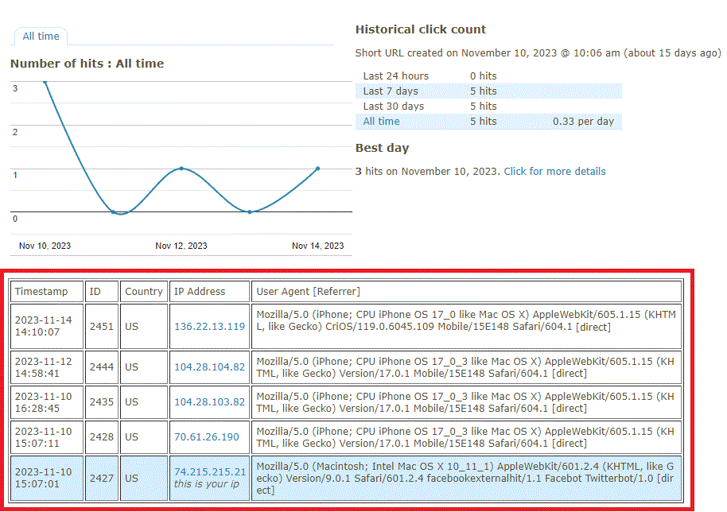

# IP Click Detail
Shows click level IP address detail and User Agent, Referrer

1. Install and enable plugin and see IP Detail on 'Traffic statistics' page.
2. Limit returned clicks in code on line 21 if needed (default limit is 1000 clicks) [LIMIT 1000]

